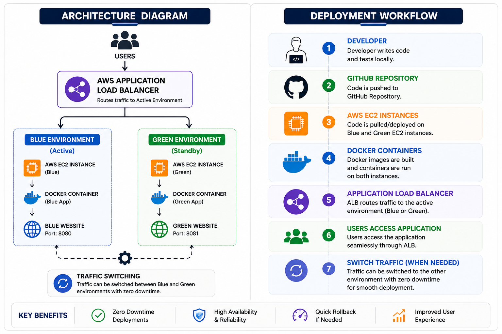
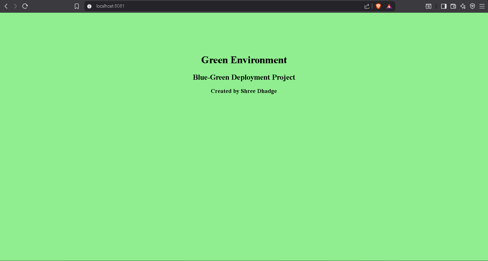
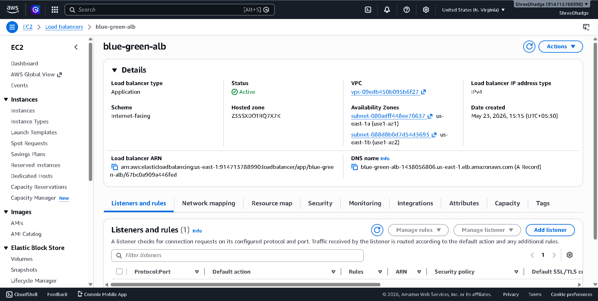
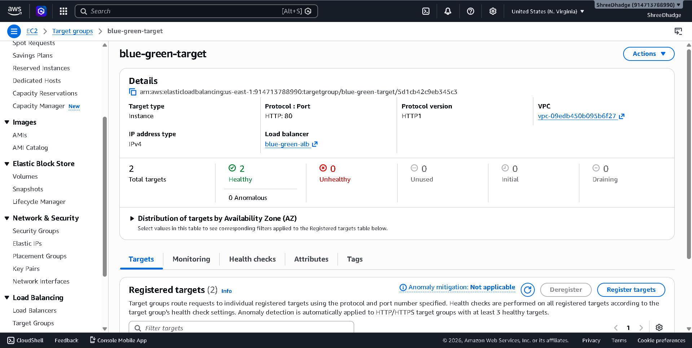

# 🚀 Blue-Green Deployment on AWS using Docker

## 📌 Project Overview
This project demonstrates a **Blue-Green Deployment strategy** using AWS EC2 instances and Docker containers. It ensures zero-downtime deployment by switching traffic between two identical environments (Blue and Green) using an AWS Application Load Balancer.

---

## 🏗️ Architecture Diagram



---

## 🔄 Deployment Workflow

- Developer writes code locally
- Code is pushed to GitHub
- AWS EC2 instances are created (Blue & Green)
- Docker containers are deployed on both environments
- AWS Load Balancer routes traffic between environments
- Users access the application seamlessly

---

## ☁️ AWS Components Used

- EC2 Instances (Blue & Green)
- Application Load Balancer (ALB)
- Security Groups
- Ubuntu Server

---

## 🐳 Docker Setup

Each environment runs a Docker container hosting a simple web application.

Example commands used:

```bash
docker build -t blue-app .
docker run -d -p 8080:80 blue-app
```

---

## 📸 Screenshots

### 🔵 Blue Environment


### 🟢 Green Environment


### 🐳 Docker Containers Running


### ☁️ AWS Load Balancer


### 🎯 Target Group Health


---

## 🔁 Load Balancer Output

### Blue Traffic


### Green Traffic


---

## 🎯 Key Features

- Zero downtime deployment
- Easy rollback (switch Blue/Green)
- Scalable architecture
- Real-world DevOps workflow

---

## 📌 Author
Shree Dhadge

---

## ⭐ Learning Outcome

- AWS EC2 setup
- Docker containerization
- Load balancing concepts
- Blue-Green deployment strategy
