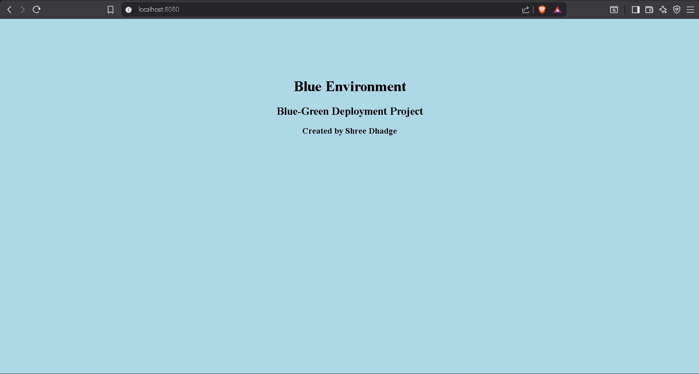
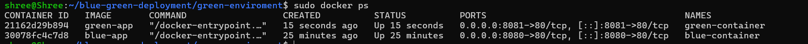
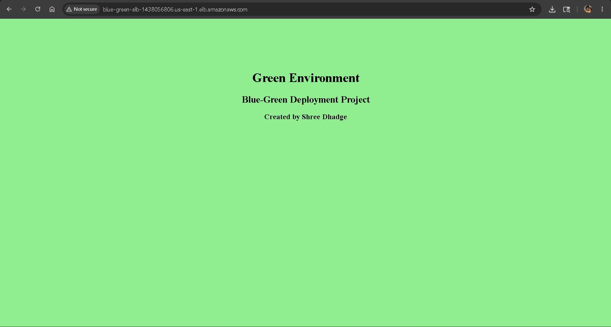

# 🚀 Blue-Green Deployment on AWS using Docker

## 📌 Overview
This project demonstrates a **Blue-Green Deployment strategy** using AWS EC2, Docker, and an Application Load Balancer (ALB).  
It ensures **zero-downtime deployment** by switching traffic between two identical environments: Blue and Green.

---

## 🏗️ Architecture


---

## 🎯 Objective

- Achieve zero downtime deployment
- Enable easy rollback between versions
- Improve deployment reliability
- Understand real-world DevOps workflow

---

## 🔄 How It Works

1. Application is deployed on **Blue environment (current live version)**
2. New version is deployed on **Green environment**
3. AWS Load Balancer controls traffic routing
4. Once tested, traffic is switched to Green
5. Blue becomes standby for rollback
# 🚀 Blue-Green Deployment on AWS using Docker
## 📌 Project Overview
This project demonstrates a **Blue-Green Deployment strategy** using AWS EC2 instances and Docker containers. It ensures zero-downtime deployment by switching traffic between two identical environments (Blue and Green) using an AWS Application Load Balancer.
---
## 🏗️ Architecture Diagram

---
## 🔄 Deployment Workflow
- Developer writes code locally
- Code is pushed to GitHub
- AWS EC2 instances are created (Blue & Green)
- Docker containers are deployed on both environments
- AWS Load Balancer routes traffic between environments
- Users access the application seamlessly
---
## ☁️ AWS Components Used
- EC2 Instances (Blue & Green)
- Application Load Balancer (ALB)
- Security Groups
- Ubuntu Server
---
## 🐳 Docker Setup
Each environment runs a Docker container hosting a simple web application.
Example commands used:
```bash
docker build -t blue-app .
docker run -d -p 8080:80 blue-app
```
---
## 📸 Screenshots
### 🔵 Blue Environment

### 🟢 Green Environment

### 🐳 Docker Containers Running

### ☁️ AWS Load Balancer

### 🎯 Target Group Health

---
## 🔁 Load Balancer Output
### Blue Traffic

### Green Traffic

---
## 🎯 Key Features
- Zero downtime deployment
- Easy rollback (switch Blue/Green)
- Scalable architecture
- Real-world DevOps workflow
---
## 📌 Author
Shree Dhadge
---
## ⭐ Learning Outcome
- AWS EC2 setup
- Docker containerization
- Load balancing concepts
- Blue-Green deployment strategy
---

